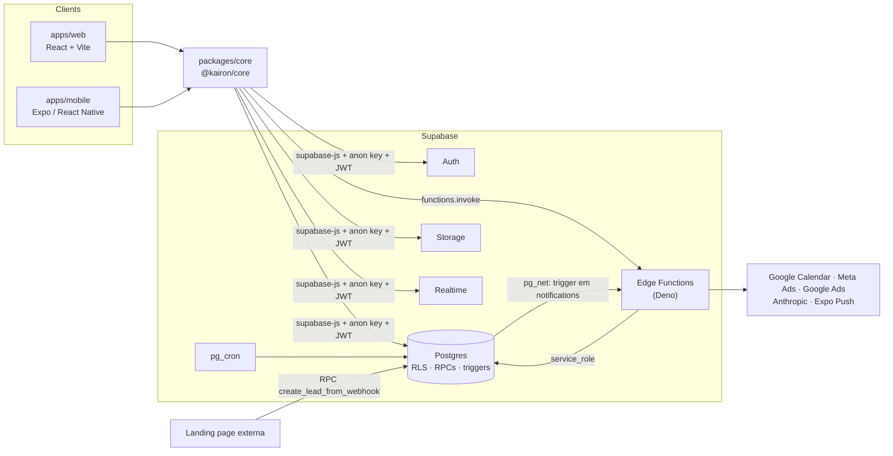

<div align="center">


# Kairon Dashboard

**Plataforma interna de operações, comercial e finanças da Kairon Company (agência de marketing).**
Web (React + Vite) e mobile (Expo) sobre um backend Supabase com RLS, Edge Functions e Realtime.


</div>

---

## Sumário

- [Contexto](#contexto)
- [Funcionalidades](#funcionalidades)
- [Visão geral do sistema](#visão-geral-do-sistema)
- [Stack](#stack)
- [Arquitetura](#arquitetura)
- [Estrutura de pastas](#estrutura-de-pastas)
- [Começando](#começando)
- [Variáveis de ambiente](#variáveis-de-ambiente)
- [Scripts](#scripts)
- [Fluxos principais](#fluxos-principais)
- [Backend: banco, auth, storage, jobs e funções](#backend-banco-auth-storage-jobs-e-funções)
- [Integrações externas](#integrações-externas)
- [Build e deploy](#build-e-deploy)
- [Convenções](#convenções)
- [Troubleshooting](#troubleshooting)
- [Pontos de atenção](#pontos-de-atenção)
- [Documentação completa](#documentação-completa)
- [Contribuindo](#contribuindo)

---

## Contexto

A agência operava comercial, entrega e financeiro em ferramentas soltas. O Kairon Dashboard centraliza o ciclo inteiro de um cliente em uma só base de dados:

```
Lead (landing page / manual) → atendimento SDR/BDR → reunião com closer → conversão em cliente
   → contrato (MRR ou TCV) → parcelas a receber → squads, projetos e tarefas → metas, DRE e relatórios
```

Cada colaborador vê apenas o que o seu papel permite. A regra vale tanto na interface quanto no banco (Row Level Security). Assim, a mesma base atende SDRs, closers, time de entrega, liderança e uma TV de metas no escritório.

## Funcionalidades

| Módulo | Rota | O que faz |
|---|---|---|
| **Visão Geral** | `/` | Painel inicial com KPIs, tarefas, projetos, squads e atividades recentes |
| **Calendário** | `/calendario` | Eventos internos com público (todos / squad / pessoas / C-level), lembretes por notificação e sincronização com Google Calendar |
| **Metas** | `/metas` | Meta mensal global e por closer, registro de vendas, "feito da meta" (MRR ativo + TCV do mês + vendas avulsas) e modo TV |
| **Comercial** | `/comercial` | Pipeline Kanban de leads (`pendente → em_atendimento → follow_up → reuniao_marcada / perdido`), com notificações em tempo real e conversão em cliente |
| **Campanhas** | `/campanhas` | Campanhas e métricas de mídia. **Meta Ads:** listar, métricas, pausar, retomar e encerrar via Edge Function. **Google Ads:** ainda não implementado (só esqueleto). Há modo mock |
| **Tarefas** | `/tarefas` | Kanban de tarefas por cliente/projeto, com onboarding automático de novos clientes |
| **Clientes** | `/clientes` | Cadastro, contratos MRR/TCV, histórico, cancelamento e repositório de arquivos (upload resumível) |
| **Squads** | `/squads` | Times de entrega, membros e visão financeira por squad |
| **Membros** | `/administrativo` | Convite, edição de papel, arquivamento e exclusão de usuários, além de documentos de colaboradores |
| **Financeiro** | `/financeiro` | MRR, receita, ROI, recorrência, recebíveis, contas a pagar, custos operacionais e DRE/projeção |
| **Relatórios** | `/relatorios` | Relatório executivo gerado por IA (Claude) a partir dos números consolidados, exportável em PDF |
| **App mobile** | Expo (iOS; Android configurado) | Tarefas e eventos do dia, calendário, pipeline de leads com contato por telefone/WhatsApp e push notifications |

## Visão geral do sistema

> **Screenshots:** ainda não há imagens no repositório. Sugestão: adicionar em `docs/assets/` capturas de Visão Geral, Comercial (Kanban), Financeiro e do app mobile, e referenciá-las aqui.

**Perfis e o que cada um enxerga** (resumo; matriz completa em [docs/auth.md](docs/auth.md)):

| Perfil | Acesso principal |
|---|---|
| `admin` | Tudo, incluindo Membros, Financeiro, Relatórios e Campanhas |
| `dev` | Equivalente a admin no banco, exceto Campanhas e gestão de perfis. Na UI, sem Gestão |
| `head`, `cs` | Operacional ampliado: clientes, contratos, tarefas, calendário |
| `social media`, `editor`, `designer` | Operacional: tarefas (editor/designer editam só as próprias) |
| `sdr`, `bdr`, `closer` | Comercial: pipeline de leads e metas |
| `Filmmaker` | Visão Geral, Calendário, Tarefas e Squads de que participa |
| `tv` | Somente a tela de Metas, em modo leitura (painel de escritório) |

## Stack

| Camada | Tecnologias |
|---|---|
| **Web** | React 18, Vite 6, React Router 6, TanStack Query 5, Tailwind CSS 3, shadcn/ui (Radix), Framer Motion, Recharts, React Hook Form + Zod, `@hello-pangea/dnd` (Kanban), tus-js-client (upload), jsPDF + html2canvas |
| **Mobile** | Expo SDK 56, React Native 0.85, Expo Router (native tabs), TanStack Query, expo-notifications, AsyncStorage |
| **Código compartilhado** | `@kairon/core`: cliente Supabase, módulos de API, query keys, sessão e cálculo financeiro |
| **Backend** | Supabase: Postgres (RLS, funções `SECURITY DEFINER`, triggers), Auth, Storage, Realtime, `pg_cron`, `pg_net` e Edge Functions (Deno/TypeScript) |
| **Integrações** | Google Calendar API, Meta Marketing API, Anthropic API (Claude), Expo Push API, Google Ads API (em construção) |
| **Infra** | Docker multi-stage (Node 20 → Nginx 1.27), EasyPanel; EAS Build para o mobile |
| **Qualidade** | Vitest (testes de cálculo financeiro e contratos), ESLint, `tsc` sobre JS (`checkJs`) |

## Arquitetura



**Princípios do desenho:**

- **Não há servidor próprio.** Os clientes falam direto com o Supabase. A autorização real está no banco (RLS e RPCs `SECURITY DEFINER`), e a UI apenas espelha as regras.
- **Os segredos ficam só nas Edge Functions.** Tokens de Google, Meta, Anthropic e a `service_role` nunca chegam ao front.
- **Uma única fonte de lógica.** O cliente Supabase, as APIs e o cálculo financeiro vivem em `@kairon/core`, consumido por web e mobile. As pastas `api/` das features do web são *shims* que reexportam do core.
- **Regras de negócio críticas ficam em RPCs atômicas** (criar/cancelar contrato, converter lead, apagar cliente), para não depender do front.

Detalhes em [docs/architecture.md](docs/architecture.md).

## Estrutura de pastas

```
.
├── apps/
│   ├── web/                    # Dashboard web (React + Vite)
│   │   ├── src/app/            #   App.jsx: providers e roteamento por papel
│   │   ├── src/features/<mod>/ #   Módulos de domínio: api/ components/ pages/ lib/
│   │   ├── src/shared/         #   Layout, guards, ui/ (shadcn), hooks, config
│   │   ├── src/lib/            #   Serviços de anúncios (mock/real), utils
│   │   └── src/infrastructure/ #   Shim do cliente Supabase
│   └── mobile/                 # App Expo (expo-router em src/app)
├── packages/
│   └── core/                   # @kairon/core: client, api/*, finance/*, auth, query-keys
├── supabase/
│   ├── schema.sql              # Schema base (tabelas, RLS, RPCs)
│   ├── migrations/             # Migrations incrementais (aplicar em ordem)
│   ├── triggers/               # Triggers de cliente (onboarding/backlog)
│   ├── cron/                   # Jobs pg_cron
│   ├── functions/              # Edge Functions (Deno)
│   └── config.toml             # Config do Supabase CLI (verify_jwt por função)
├── docs/                       # Documentação técnica
├── Dockerfile · nginx.conf     # Build e serving do web em produção
└── package.json                # Monorepo npm workspaces
```

## Começando

### Pré-requisitos

| Ferramenta | Versão | Uso |
|---|---|---|
| Node.js | 20+ (o Dockerfile usa 20) | Web, core e mobile |
| npm | 10+ | Workspaces |
| Projeto Supabase | — | Banco, Auth, Storage, Functions |
| Supabase CLI | recente | Deploy de Edge Functions e secrets |
| Xcode / Android Studio | — | Apenas para o app mobile |

### Instalação

```bash
git clone https://github.com/NycollasMartins/Dashboard_Kairon_Company.git
cd Dashboard_Kairon_Company
npm install                      # instala todos os workspaces
cp apps/web/.env.example apps/web/.env.local
# preencha VITE_SUPABASE_URL e VITE_SUPABASE_ANON_KEY
```

### Banco de dados (projeto novo)

Execute no **SQL Editor** do Supabase, nesta ordem:

1. `supabase/schema.sql`
2. `supabase/migrations/*.sql`, em ordem de nome (timestamp)
3. `supabase/triggers/onboarding_on_cliente.sql` e `supabase/triggers/backlog_on_cliente.sql`
4. `supabase/cron/expirar_contratos.sql` (exige a extensão `pg_cron`)

> ⚠️ Antes do passo 2, ajuste a URL e a anon key fixas em `migrations/20260608000000_push_tokens.sql`, e o e-mail fixo em `triggers/onboarding_on_cliente.sql`, para o seu ambiente. Veja [docs/database.md](docs/database.md#bootstrap-de-um-ambiente-novo).

Depois do primeiro cadastro, promova sua conta a admin:

```sql
UPDATE public.profiles SET role = 'admin' WHERE email = '<seu-email>';
```

### Rodando localmente

```bash
npm run dev          # web em http://localhost:5173
npm run mobile       # app mobile (Expo; exige apps/mobile/.env)
```

Guia passo a passo e checklist em [docs/setup.md](docs/setup.md).

## Variáveis de ambiente

Somente placeholders. Os valores reais nunca são versionados (`.env*` está no `.gitignore`, exceto `.env.example`).

**Web (`apps/web/.env.local`)**, embutidas no bundle público:

| Variável | Obrigatória | Descrição |
|---|---|---|
| `VITE_SUPABASE_URL` | ✅ | URL do projeto Supabase |
| `VITE_SUPABASE_ANON_KEY` | ✅ | Anon key (pública por design; a proteção é o RLS) |
| `VITE_SITE_URL` | — | Base do link de convite; o fallback é `window.location.origin` |
| `VITE_ADS_USE_MOCK` | — | Qualquer valor ≠ `false` usa dados simulados de anúncios. O Dockerfile usa `false` |
| `VITE_RECEITA_POR_CONVERSAO` | — | Receita estimada por conversão (proxy de ROAS). Default `80` |

**Mobile (`apps/mobile/.env`):** `EXPO_PUBLIC_SUPABASE_URL` e `EXPO_PUBLIC_SUPABASE_ANON_KEY`.

**Edge Functions (secrets do Supabase):** `ANTHROPIC_API_KEY`, `GOOGLE_CALENDAR_*`, `META_*`, `GOOGLE_ADS_*`, `SITE_URL`. Modelo em [`supabase/functions/.env.example`](supabase/functions/.env.example).

## Scripts

Rodados na raiz do monorepo:

| Comando | Descrição |
|---|---|
| `npm run dev` | Servidor de desenvolvimento do web (Vite) |
| `npm run build` | Build de produção do web em `apps/web/dist` |
| `npm run start` | Preview do build em `0.0.0.0:4173` |
| `npm run lint` | ESLint do web (veja [pontos de atenção](#pontos-de-atenção)) |
| `npm run typecheck` | `tsc` sobre o JS do web (`checkJs`) |
| `npm test -w apps/web` | Testes Vitest |
| `npm run mobile` | `expo start` |
| `npm run mobile:ios` / `mobile:android` | Build e execução nativa local |

## Fluxos principais

<details>
<summary><b>Convite e primeiro acesso</b></summary>

1. O admin convida em **Membros**, e o front chama a Edge Function `invite-user` com e-mail, nome, papel e origem.
2. A função valida se quem chama é admin e envia o convite pelo Supabase Auth, com redirect para `/aceitar-convite`.
3. O usuário define a senha. A sessão é detectada na URL (`detectSessionInUrl`).
4. O `AuthContext` carrega `profiles`. Se `archived_at` estiver preenchido, faz logout e redireciona para `/login?reason=archived`.
</details>

<details>
<summary><b>Lead → cliente → contrato</b></summary>

1. O lead entra pela landing page, chamando a RPC pública `create_lead_from_webhook`, ou é criado manualmente, como `pendente`.
2. Um trigger notifica o time comercial (Realtime e push).
3. O SDR/BDR assume o lead (`em_atendimento`). O trigger `leads_atendimento_guard` valida o responsável e registra o horário.
4. O closer marca a reunião (evento no calendário) e converte o lead com `convert_lead_to_cliente`, que cria o cliente com `origem = 'lead'` numa única operação.
5. Novos clientes disparam triggers que criam os projetos **Onboarding** (com tarefas iniciais) e **Backlog**.
6. `criar_contrato` cria o contrato MRR/TCV, gera a venda da meta do closer e as parcelas em `contrato_parcelas`.
</details>

<details>
<summary><b>Ciclo de vida do contrato</b></summary>

- Status: `ativo → expirado | renovado | cancelado`.
- `cancelar_contrato` calcula o total recebido (MRR: meses decorridos × valor; TCV: valor cheio) ou aceita um valor informado.
- O job `pg_cron` `expirar-contratos` roda diariamente às 03:00 UTC e expira contratos vencidos.
- O trigger `clientes_block_churn_if_active_contract` impede marcar um cliente como churn enquanto houver contrato ativo.
</details>

<details>
<summary><b>Notificações</b></summary>

- Eventos de negócio (novo lead, meta atingida, evento de calendário, lembretes de 24h e 20min) inserem linhas em `public.notifications`.
- **Web:** assinatura Realtime por usuário e sino no header.
- **Mobile:** o trigger `notifications_push_fanout` chama, via `pg_net`, a função `push-fanout`, que envia pela Expo Push API e remove tokens inválidos.
</details>

<details>
<summary><b>Financeiro</b></summary>

Todo cálculo vive em `packages/core/src/finance/finance.calc.js`, com funções puras e cobertas por testes. As premissas de reconhecimento são:

- **MRR:** reconhecido uma vez por mês durante a vigência do contrato.
- **TCV:** 100% no mês do fechamento (regime caixa). Há também a visão linear.
- **Caixa real:** parcelas com `pago_em`.
- **Receita do mês** = MRR ativo + TCV do mês + vendas avulsas, a mesma regra da tela de Metas.
</details>

Mais fluxos (calendário, campanhas, relatórios, arquivos) em [docs/frontend.md](docs/frontend.md) e [docs/api.md](docs/api.md).

## Backend: banco, auth, storage, jobs e funções

| Recurso | Resumo | Doc |
|---|---|---|
| **Banco** | 24 tabelas em `public`, RLS em todas, helpers `SECURITY DEFINER` no schema `private` | [database.md](docs/database.md) |
| **Auth** | Supabase Auth: e-mail/senha, Google e Apple OAuth (web) e recuperação de senha. Onboarding por convite, papéis em `profiles.role` e arquivamento por banimento | [auth.md](docs/auth.md) |
| **Storage** | Buckets privados `client-files` (até 5 GB, upload resumível TUS) e `member-files` (200 MB), com URLs assinadas | [database.md](docs/database.md#storage) |
| **Realtime** | `leads`, `notifications`, `metas`, `vendas` e as tabelas do Financeiro | [database.md](docs/database.md#realtime) |
| **Jobs** | `pg_cron`: `expirar-contratos` (diário) e `notify-upcoming-events` (a cada 5 min) | [database.md](docs/database.md#jobs-pg_cron) |
| **Edge Functions** | 9 funções: usuários/convites, Google Calendar, Meta/Google Ads, relatório IA e push | [api.md](docs/api.md) |
| **Webhook de entrada** | RPC `create_lead_from_webhook`, liberada para `anon` (landing page) | [api.md](docs/api.md#rpcs-postgres) |

## Integrações externas

| Integração | Onde | Observação |
|---|---|---|
| Google Calendar | `google-calendar-oauth`, `google-calendar-sync` | Um calendário único da empresa. OAuth com tokens guardados no banco (só `service_role`) |
| Meta Marketing API | `meta-ads` | ✅ Lista campanhas e métricas, pausa, retoma e encerra. `createCampaign` desabilitado (501) |
| Google Ads API | `google-ads` | 🚧 Só o esqueleto: autenticação pronta, todas as ações retornam 501 |
| Anthropic (Claude) | `generate-report` | Relatório executivo em blocos (texto, KPIs, gráficos, tabelas) |
| Expo Push | `push-fanout` | Disparado por trigger via `pg_net` |
| Landing page | RPC `create_lead_from_webhook` | Entrada de leads inbound |

Configuração de cada uma em [docs/integrations.md](docs/integrations.md).

## Build e deploy

**Web:** imagem Docker multi-stage. O build roda em Node 20 e o `dist/` é servido por Nginx com fallback de SPA e cache longo de assets.

```bash
docker build \
  --build-arg VITE_SUPABASE_URL=https://<project-ref>.supabase.co \
  --build-arg VITE_SUPABASE_ANON_KEY=<anon-key> \
  -t kairon-web .
docker run -p 8080:80 kairon-web
```

Em produção o deploy é feito no **EasyPanel**, com as `VITE_*` como build args e a porta 80 exposta.

**Edge Functions:** `supabase functions deploy <nome>`. A função `google-calendar-oauth` precisa de `verify_jwt = false`, já configurado em `config.toml`.

**Mobile:** EAS Build (`development`, `preview` e `production`), com distribuição iOS via Unlisted App Distribution.

Passo a passo e checklist de pré-deploy em [docs/deployment.md](docs/deployment.md).

## Convenções

- **Organização por feature:** `features/<modulo>/{api,components,pages,lib,constants}`. O código de acesso a dados novo vai em `packages/core/src/api/` e é reexportado pelo shim da feature.
- **Dados:** sempre TanStack Query com chaves de `@kairon/core/entities/query-keys`. Não use `fetch` solto.
- **Regras de acesso:** toda regra nova precisa de policy RLS ou RPC no banco. Esconder na UI não é segurança.
- **Banco:** migrations idempotentes (`IF NOT EXISTS`, `DROP ... IF EXISTS`), nomeadas `YYYYMMDDHHMMSS_descricao.sql`.
- **Domínio em português** (tabelas, colunas, rotas, funções); código de infraestrutura em inglês.
- **Commits:** `tipo/ escopo: descrição` (ex.: `feat/ financeiro: aba "Contas a Pagar"`).
- **Alias:** `@/` aponta para `apps/web/src`, e `@/components/ui` para `src/shared/ui`.

Guia completo em [docs/contributing.md](docs/contributing.md).

## Troubleshooting

| Sintoma | Causa provável | Solução |
|---|---|---|
| Tela em branco com o erro "Supabase não inicializado" ou "faltam url/anonKey" | `.env.local` ausente ou sem as variáveis `VITE_*` | Crie `apps/web/.env.local` e reinicie o Vite |
| Login funciona, mas o usuário aparece como `sdr` sem dados | Falha ao ler `profiles` (RLS ou linha ausente) | Verifique a linha em `profiles` e o trigger `on_auth_user_created` |
| O link do convite cai em `localhost` ou dá erro | Redirect URL não cadastrada | Adicione a origem em Auth → URL Configuration |
| Campanhas exibem dados falsos | Modo mock ativo (`VITE_ADS_USE_MOCK` ≠ `false`) | Defina `false` e configure os secrets |
| Variável alterada não surte efeito em produção | `VITE_*` são embutidas no build | Faça rebuild da imagem |
| Push não chega no celular | URL/anon key fixas no trigger, `pg_net` desabilitado ou token ausente | Veja [troubleshooting.md](docs/troubleshooting.md#push-notifications) |

Lista completa em [docs/troubleshooting.md](docs/troubleshooting.md).

## Pontos de atenção

Riscos conhecidos, documentados para quem for manter o sistema (detalhes em [docs/security.md](docs/security.md) e [docs/decisions.md](docs/decisions.md)):

- 🔴 **Escalada de privilégio via `profiles.role`.** A policy `profiles: self update` (`schema.sql`) permite que o usuário atualize a própria linha sem restringir colunas, e nenhum trigger impede a troca de `role`. Pelo SQL versionado, qualquer usuário logado pode se promover a `admin`. Confirme no banco de produção e corrija com prioridade (veja [docs/security.md](docs/security.md#1-escalada-de-privilégio-via-profilesrole)).
- 🔴 **`generate-report` não valida o papel de quem chama.** Qualquer JWT válido, inclusive a anon key pública, consegue disparar chamadas pagas à Anthropic.
- 🔴 **Cadastro aberto precisa de validação manual.** Todo usuário novo recebe `role = 'sdr'` (trigger `handle_new_user`), com acesso de leitura a leads. Se "Allow new users to sign up" estiver ligado no Supabase, ou se Google/Apple OAuth aceitar qualquer conta, qualquer pessoa entra no sistema.
- 🟠 **A RPC `create_lead_from_webhook` é liberada para `anon`**, sem rate limit nem captcha.
- 🟠 **Há valores fixos ligados ao ambiente** em SQL versionado: URL e anon key em `push_tokens.sql`, e-mail de um colaborador em `onboarding_on_cliente.sql`.
- 🟡 **O bootstrap do banco é manual**: `schema.sql` mais migrations, fora do fluxo `supabase db push`.
- 🟡 **O ESLint não analisa nenhum arquivo.** Os globs apontam para `src/components` e `src/pages`, que não existem. O `typecheck` acusa cerca de 970 erros.
- 🟡 **Os papéis estão fixos no código em vários lugares** (web, mobile, Edge Functions e SQL), e já existem divergências entre menu e guarda de página.
- 🟡 **Não há CI.** Testes, lint e build não rodam automaticamente.

## Documentação completa

| Documento | Conteúdo |
|---|---|
| [architecture.md](docs/architecture.md) | Camadas, monorepo, fluxo de dados, `@kairon/core` |
| [setup.md](docs/setup.md) | Ambiente local passo a passo e checklist |
| [database.md](docs/database.md) | Tabelas, RLS, RPCs, triggers, cron, storage, realtime |
| [auth.md](docs/auth.md) | Autenticação, convites, papéis e matriz de permissões |
| [api.md](docs/api.md) | Edge Functions, RPCs e módulos de API do core |
| [frontend.md](docs/frontend.md) | Rotas, providers, módulos e componentes críticos do web |
| [mobile.md](docs/mobile.md) | App Expo: navegação, push, build |
| [integrations.md](docs/integrations.md) | Google Calendar, Meta/Google Ads, Anthropic, Expo Push |
| [deployment.md](docs/deployment.md) | Docker/EasyPanel, Edge Functions, EAS, checklist de pré-deploy |
| [troubleshooting.md](docs/troubleshooting.md) | Problemas comuns e diagnóstico |
| [security.md](docs/security.md) | Modelo de segurança, riscos conhecidos e recomendações |
| [decisions.md](docs/decisions.md) | Decisões de arquitetura (ADRs resumidos) e dívida técnica |
| [contributing.md](docs/contributing.md) | Fluxo de trabalho, convenções e onboarding de devs |

## Contribuindo

1. Leia [docs/setup.md](docs/setup.md) e [docs/contributing.md](docs/contributing.md).
2. Crie um branch a partir de `main` (`feat/...`, `fix/...`, `chore/...`).
3. Antes do PR, rode `npm test -w apps/web` e `npm run build`. Se tocar no banco, inclua a migration idempotente e atualize [docs/database.md](docs/database.md).

---

<sub>Projeto proprietário da Kairon Company. Uso interno.</sub>
