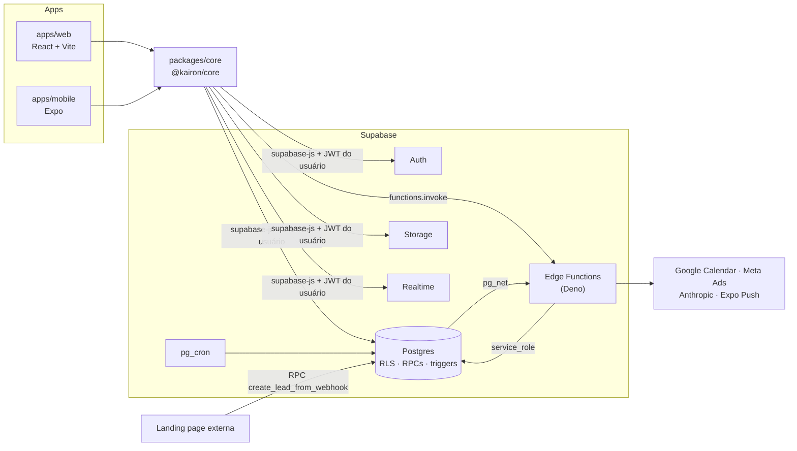

<div align="center">


# Kairon Dashboard

**Plataforma interna de operações, comercial e finanças da Kairon Company (agência de marketing).**
Dashboard web (React + Vite) e app mobile (Expo) sobre Supabase (Postgres com RLS, Auth, Storage, Realtime e Edge Functions).


</div>

---

## Sumário

1. [Comece por aqui](#1-comece-por-aqui)
2. [O que o sistema faz](#2-o-que-o-sistema-faz)
3. [Arquitetura em 2 minutos](#3-arquitetura-em-2-minutos)
4. [Mapa do código: onde fica cada coisa](#4-mapa-do-código-onde-fica-cada-coisa)
5. [Como ajustar: receitas passo a passo](#5-como-ajustar-receitas-passo-a-passo)
6. [Rodando localmente](#6-rodando-localmente)
7. [Banco de dados: como aplicar mudanças](#7-banco-de-dados-como-aplicar-mudanças)
8. [Deploy: o que sobe para onde](#8-deploy-o-que-sobe-para-onde)
9. [Testes e qualidade](#9-testes-e-qualidade)
10. [Troubleshooting rápido](#10-troubleshooting-rápido)
11. [Estado atual e pendências](#11-estado-atual-e-pendências)
12. [Documentação detalhada](#12-documentação-detalhada)
13. [Convenções e contribuição](#13-convenções-e-contribuição)

---

## 1. Comece por aqui

Se você acabou de assumir o projeto, siga esta ordem:

| # | Faça | Tempo |
|---|---|---|
| 1 | Leia as seções [2](#2-o-que-o-sistema-faz) e [3](#3-arquitetura-em-2-minutos) deste README | 5 min |
| 2 | Leia o [estado atual e as pendências](#11-estado-atual-e-pendências): há correções de segurança **aguardando aplicação em produção** | 2 min |
| 3 | Suba o ambiente local ([seção 6](#6-rodando-localmente)) | 15 min |
| 4 | Use o [mapa do código](#4-mapa-do-código-onde-fica-cada-coisa) para localizar o módulo que vai alterar | — |
| 5 | Siga a [receita](#5-como-ajustar-receitas-passo-a-passo) correspondente à mudança | — |

**As 4 regras que evitam 90% dos problemas neste projeto:**

1. **Segurança mora no banco, não na tela.** Esconder um botão não protege nada: qualquer usuário logado consegue chamar a API direto. Toda regra de acesso precisa de policy RLS ou RPC no Supabase.
2. **Lógica compartilhada vai em `packages/core`.** Web e mobile usam o mesmo código de dados e de cálculo. Não duplique regra de negócio.
3. **Cálculo financeiro só em `packages/core/src/finance/finance.calc.js`.** Financeiro, Metas, Relatórios e Squads leem dali. Se você alterar uma conta em outro lugar, os números vão divergir entre telas.
4. **Mudança de banco é feita à mão.** Não existe migração automática: você cria o arquivo SQL e aplica no SQL Editor do Supabase. Fazer push no GitHub **não altera o banco**.

## 2. O que o sistema faz

Ciclo de vida completo de um cliente da agência:

```
Lead (landing page / manual) → atendimento SDR/BDR → reunião com closer → conversão em cliente
   → contrato (MRR ou TCV) → parcelas a receber → squads, projetos e tarefas → metas, DRE e relatórios
```

| Módulo | Rota | O que faz |
|---|---|---|
| Visão Geral | `/` | Painel inicial com KPIs, tarefas, projetos, squads e atividades recentes |
| Calendário | `/calendario` | Eventos com público (todos / squad / pessoas / C-level), lembretes e sincronização com Google Calendar |
| Metas | `/metas` | Meta do mês (global e por closer), vendas, ranking e modo TV |
| Comercial | `/comercial` | Pipeline Kanban de leads com SLA, tempo real e conversão em cliente |
| Campanhas | `/campanhas` | Campanhas e métricas Meta Ads (Google Ads ainda é esqueleto) |
| Tarefas | `/tarefas` | Kanban de tarefas por cliente e projeto |
| Clientes | `/clientes` | Cadastro, contratos MRR/TCV, projetos e arquivos |
| Squads | `/squads` | Times de entrega, membros e visão financeira |
| Membros | `/administrativo` | Convites, papéis, arquivamento e documentos de colaboradores |
| Financeiro | `/financeiro` | MRR, receita, recebíveis, contas a pagar, custos e DRE |
| Relatórios | `/relatorios` | Relatório executivo gerado por IA (Claude), exportável em PDF |
| App mobile | iOS (Expo) | Hoje (tarefas e eventos), Calendário, Leads e push notifications |

**Papéis** (`profiles.role`):

| Papel | Enxerga |
|---|---|
| `admin` | Tudo |
| `dev` | Quase tudo no banco (exceto Campanhas e gestão de papéis). Na UI, não vê Gestão |
| `head`, `cs` | Operacional ampliado: clientes, contratos, tarefas, calendário |
| `social media`, `editor`, `designer` | Tarefas e operacional |
| `sdr`, `bdr`, `closer` | Comercial (leads) e Metas |
| `Filmmaker` | Visão Geral, Calendário, Tarefas e os Squads de que participa |
| `tv` | Só Metas, em modo leitura (painel do escritório) |
| `pendente` | Nada: conta criada sem convite, aguardando um admin definir o papel |

A matriz completa, papel por tela e por ação, está em [docs/auth.md](docs/auth.md).

## 3. Arquitetura em 2 minutos



- **Não existe backend próprio.** O front fala direto com o Postgres via `supabase-js`, e o que cada usuário pode ver ou alterar é decidido por **RLS**.
- **O que exige segredo** (tokens Google, Meta, Anthropic, `service_role`) fica nas **Edge Functions** (`supabase/functions/`).
- **Operações críticas** (criar/cancelar contrato, converter lead, apagar cliente) são **RPCs atômicas** no Postgres.
- **Automação** é feita por triggers e `pg_cron`: notificações, onboarding de cliente, expiração de contratos e push.

**O caminho de um dado**, do clique até o banco:

```
Componente (features/<mod>/components)
  └─ useQuery / useMutation (TanStack Query, chave em queryKeys)
       └─ xApi.metodo()            packages/core/src/api/<mod>.api.js
            └─ supabase.from() / .rpc() / .functions.invoke()
                 └─ Postgres: RLS filtra → trigger/RPC aplica a regra → resposta
  ◄─ invalidateQueries(queryKeys.x) atualiza a tela · Realtime avisa outros usuários
```

## 4. Mapa do código: onde fica cada coisa

### 4.1 Estrutura de pastas

```
.
├── apps/
│   ├── web/
│   │   ├── src/main.jsx                 # entrada: initSupabase() + render
│   │   ├── src/app/App.jsx              # providers + ROTAS (por papel)
│   │   ├── src/features/<modulo>/       # um diretório por módulo de negócio
│   │   │   ├── pages/                   #   telas roteáveis (*PageWrapper = guarda de papel + sub-rotas)
│   │   │   ├── components/              #   modais, cards, seções, kanbans
│   │   │   ├── api/                     #   reexporta @kairon/core/api (ou API própria do web)
│   │   │   ├── lib/                     #   cálculos/helpers do módulo
│   │   │   └── constants/               #   opções de selects e enums de UI
│   │   ├── src/shared/
│   │   │   ├── components/layout/       #   Sidebar (MENU), Header, Breadcrumbs
│   │   │   ├── components/              #   ProtectedRoute, RestrictedAccessCard, PageNotFound
│   │   │   ├── ui/                      #   componentes shadcn/ui (botão, dialog, select...)
│   │   │   └── config/app.js            #   link de download do app
│   │   ├── src/lib/                     #   serviços de anúncios (mock/real)
│   │   ├── src/index.css                #   tema (variáveis CSS) e classes globais
│   │   ├── public/                      #   logos e imagens estáticas
│   │   └── .env.example
│   └── mobile/
│       ├── src/app/                     # telas (Expo Router: arquivo = rota)
│       ├── src/components/              # sheets, modais, calendário
│       ├── src/constants/               # tema, status de lead, papéis comerciais
│       ├── src/notifications/           # push + badge de leads
│       ├── app.json · eas.json          # config do app e perfis de build
│       └── .env.example
├── packages/core/src/
│   ├── supabase/client.js               # cliente Supabase compartilhado
│   ├── api/*.api.js                     # TODO acesso a dados compartilhado
│   ├── finance/finance.calc.js          # TODO cálculo financeiro
│   ├── auth/session.js                  # leitura do perfil do usuário
│   ├── entities/query-keys.js           # chaves de cache do TanStack Query
│   └── lib/query-client.js              # defaults do QueryClient
├── supabase/
│   ├── schema.sql                       # schema base (tabelas, RLS, RPCs)
│   ├── migrations/                      # mudanças incrementais (aplicar em ordem)
│   ├── triggers/                        # projetos Onboarding/Backlog de cliente novo
│   ├── cron/                            # jobs agendados
│   ├── functions/<nome>/index.ts        # Edge Functions
│   ├── functions/.env.example           # secrets das funções
│   └── config.toml                      # verify_jwt por função
├── docs/                                # documentação técnica detalhada
├── Dockerfile · nginx.conf              # build e serving do web
└── package.json                         # monorepo (npm workspaces)
```

### 4.2 Por módulo

Caminhos relativos a `apps/web/src/features/` (telas e componentes) e a `packages/core/src/api/` (API).

| Módulo | Tela | Componentes principais | API | Banco: tabelas · RPC · trigger |
|---|---|---|---|---|
| **Visão Geral** | `dashboard/pages/VisaoGeralPage.jsx` | `dashboard/components/` (`KpiCard`, `LeadsChart`, `TeamPerformance`, `AtividadesRecentes`) | `tarefas`, `projetos`, `squads` | — |
| **Calendário** | `calendario/pages/CalendarioPage.jsx` | `CalendarMonthGrid`, `EventoForm`, `EventoDetalhe`, `lib/eventConfig.js` | `calendario.api.js` · web: `calendario/api/googleCalendar.api.js` | `calendar_events`, `event_attendees` · `google_calendar_status()` · cron `notify-upcoming-events` · funções `google-calendar-*` |
| **Metas** | `metas/pages/MetasPage.jsx` | `VendaModal`, `MetaValorModal`, `CloserDetalheModal`, `MetaCelebrationModal`, `lib/metas.calc.js` | `metas.api.js` | `metas`, `vendas` · `mrr_base_ativo()`, `tcv_mes_ativo()` · trigger `vendas_notify_meta` |
| **Comercial** | `comercial/pages/ComercialPage.jsx` | `LeadsKanban` (colunas), `LeadCard` (SLA), `LeadDetalheModal`, `LeadNovoModal`, `ConverterLeadModal`, `constants/leadOptions.js` | `leads.api.js` | `leads` · `create_lead_from_webhook`, `convert_lead_to_cliente` · triggers `leads_atendimento_guard`, `leads_notify_new` |
| **Campanhas** | `campanhas/pages/CampanhasPage.jsx`, `CampanhaDetalhePage.jsx` | `CampanhaForm`, `constants/campaignOptions.js` · `src/lib/adsService*.js` | `campanhas.api.js` | `campaigns`, `campaign_metrics` · funções `meta-ads`, `google-ads` |
| **Tarefas** | `tarefas/pages/MinhasTarefasPage.jsx` | `ClienteTarefasKanban` · `projetos/components/ProjetoKanban.jsx` | `tarefas.api.js`, `projetos.api.js` | `tarefas`, `projetos` · `supabase/triggers/onboarding_on_cliente.sql` |
| **Clientes** | `clientes/pages/ClientesPage.jsx`, `ClienteDetalhePage.jsx` | `ClienteForm`, `ContratosSection`, `ContratoFormModal`, `CancelarContratoModal`, `HistoricoContratos`, `ClienteArquivos` | `clientes.api.js`, `contratos.api.js` · web: `clientes/api/arquivos.api.js` | `clientes`, `contratos`, `contrato_parcelas`, `client_folders`, `client_files` · `criar_contrato`, `cancelar_contrato`, `apagar_cliente_completo` · bucket `client-files` |
| **Squads** | `squads/pages/SquadsPage.jsx`, `SquadDetalhePage.jsx` | `SquadCard`, `SquadForm`, `SquadFinanceiroSection` | `squads.api.js`, `squad-membros.api.js` | `squads`, `squad_membros` |
| **Membros** | `administrativo/pages/AdministrativoPage.jsx` | `InviteUserDialog`, `DeleteUserDialog`, `UserDocumentsDialog`, **`lib/roleConfig.js`** | `users.api.js`, `invites.api.js` · web: `administrativo/api/memberDocs.api.js` | `profiles`, `member_documents`, view `user_invites_view` · funções `invite-user`, `cancel-invite`, `manage-user` · bucket `member-files` |
| **Financeiro** | `financeiro/pages/FinanceiroPage.jsx` | `RecorrenciaSection`, `RecebiveisSection`, `ContasPagarSection`, `CustosOperacionais`, `DreProjecaoSection`, `MetricaModal` | `financeiro.api.js` · cálculo: `packages/core/src/finance/finance.calc.js` | `contratos`, `contrato_parcelas`, `operational_costs`, `custo_pagamentos`, `finance_config`, `vendas` |
| **Relatórios** | `relatorios/pages/RelatoriosPage.jsx` | `ReportBlocks` (renderiza a resposta da IA), `lib/aggregate.js` (monta os números) | web: `relatorios/api/relatorios.api.js` | função `generate-report` |
| **Notificações** | sino no `Header` | `notifications/NotificationsContext.jsx`, `NotificationBell.jsx` | web: `notifications/api/notifications.api.js` | `notifications`, `push_tokens` · trigger `notifications_push_fanout` → função `push-fanout` |
| **Login / convite** | `auth/pages/LoginPage.jsx`, `AcceptInvitePage.jsx`, `AguardandoAprovacaoPage.jsx` | `auth/context/AuthContext.jsx` | `packages/core/src/auth/session.js` | `profiles` · trigger `on_auth_user_created` |

### 4.3 Peças transversais

| Você procura... | Está em |
|---|---|
| Lista de rotas e quais papéis veem cada conjunto | `apps/web/src/app/App.jsx` |
| **Itens do menu lateral** | `apps/web/src/shared/components/layout/Sidebar.jsx` (`getNavItems`) |
| Quem vê cada item do menu (flags `podeVer...`) | `apps/web/src/features/dashboard/pages/DashboardLayout.jsx` |
| Bloqueio de página por papel | `features/<mod>/pages/*PageWrapper.jsx` e `RestrictedAccessCard` |
| Rótulo, ícone e descrição dos papéis | `apps/web/src/features/administrativo/lib/roleConfig.js` |
| Sessão do usuário logado (`useAuth`) | `apps/web/src/features/auth/context/AuthContext.jsx` |
| Cliente Supabase | `packages/core/src/supabase/client.js` (iniciado em `apps/web/src/main.jsx` e `apps/mobile/src/app/_layout.tsx`) |
| Chaves de cache (`queryKeys`) | `packages/core/src/entities/query-keys.js` |
| Regras de acesso no banco (helpers) | funções `private.is_admin()`, `is_member()`... em `supabase/schema.sql` e `supabase/migrations/` |
| Tema e cores (web) | `apps/web/src/index.css` (variáveis `--primary`...) e `tailwind.config.js` |
| Tema e cores (mobile) | `apps/mobile/src/constants/kairon.ts` e `theme.ts` |
| Logo e imagens | `apps/web/public/` e `apps/mobile/assets/` |
| Componentes base de UI | `apps/web/src/shared/ui/` (shadcn) |
| Variáveis de ambiente | `apps/web/.env.example`, `apps/mobile/.env.example`, `supabase/functions/.env.example` |
| Build e servidor de produção | `Dockerfile`, `nginx.conf` |

## 5. Como ajustar: receitas passo a passo

Cada receita lista os arquivos **na ordem em que devem ser alterados**.

<details>
<summary><b>5.1 Adicionar um campo novo (ex.: "segmento" no cliente)</b></summary>

1. **Banco:** crie `supabase/migrations/AAAAMMDDHHMMSS_clientes_segmento.sql` com `ALTER TABLE public.clientes ADD COLUMN IF NOT EXISTS segmento text;` e aplique no SQL Editor ([seção 7](#7-banco-de-dados-como-aplicar-mudanças)).
2. **API:** se o módulo usa `select('*')`, nada muda. Se lista colunas explicitamente, inclua o campo em `packages/core/src/api/clientes.api.js`.
3. **Formulário:** `apps/web/src/features/clientes/components/ClienteForm.jsx`.
4. **Exibição:** `ClientesPage.jsx` / `ClienteDetalhePage.jsx`.
5. **Mobile** (se aplicável): o tipo em `apps/mobile/src/types/models.ts` e a tela correspondente.
6. Atualize a tabela em [docs/database.md](docs/database.md).

> O campo também é enviado pela landing page ou por alguma RPC? Então altere a função SQL correspondente (ex.: `create_lead_from_webhook`) na mesma migration.
</details>

<details>
<summary><b>5.2 Criar uma tela nova no web</b></summary>

1. Crie `apps/web/src/features/<modulo>/pages/MinhaPage.jsx`.
2. **Rota:** registre em `apps/web/src/app/App.jsx`, dentro do bloco do(s) papel(is) certo(s).
3. **Menu:** adicione o item em `getNavItems` de `shared/components/layout/Sidebar.jsx`, e a flag de visibilidade em `DashboardLayout.jsx`, se for restrito.
4. **Guarda:** se for restrita, crie um `*PageWrapper.jsx` que retorna `RestrictedAccessCard` para papéis sem acesso (copie de `clientes/pages/ClientesPageWrapper.jsx`).
5. **Dados:** a API vai em `packages/core/src/api/<modulo>.api.js` (+ chave em `query-keys.js`), consumida com `useQuery`.
6. **Banco:** policies RLS para as tabelas novas. **Sem isso, a tela é só aparência.**
</details>

<details>
<summary><b>5.3 Mudar quem acessa o quê</b></summary>

As regras existem em **duas camadas**, e as duas precisam mudar juntas:

| Camada | Onde |
|---|---|
| **Banco (segurança real)** | Policies e helpers `private.*` em uma migration nova. Ex.: liberar leads para `head` = ajustar a policy de `leads` ou o helper `private.is_admin_or_closer()` |
| Menu | `DashboardLayout.jsx` (flags) e `Sidebar.jsx` |
| Rota | `App.jsx` (conjuntos especiais de `tv`, `Filmmaker` e `pendente`) |
| Página | `*PageWrapper.jsx` e constantes como `TAREFAS_ROLES` em `MinhasTarefasPage.jsx` |
| Ações dentro da tela | checagens `user?.role === ...` nos componentes (ex.: `ContratosSection.jsx`, `LeadsKanban.jsx`) |
| Mobile | `apps/mobile/src/constants/leads.ts` (`ROLES_COMERCIAL`) |
| Edge Functions | checagem de `profile.role` no início de cada `supabase/functions/*/index.ts` |

Para achar todas as listas de papéis: `grep -rn "includes(role)\|role ===" apps packages supabase/functions`. Depois, atualize a matriz em [docs/auth.md](docs/auth.md).
</details>

<details>
<summary><b>5.4 Criar um papel novo</b></summary>

1. Migration: acrescente o papel ao `CHECK` de `profiles.role` (copie de `supabase/migrations/20261005000100_papel_pendente_novos_usuarios.sql`, seção 1) e ajuste os helpers e policies que o papel deve satisfazer.
2. `supabase/functions/invite-user/index.ts`: inclua o papel em `ALLOWED_ROLES` e faça o deploy da função.
3. `apps/web/src/features/administrativo/lib/roleConfig.js`: label, ícone, cor e descrição.
4. Revise as listas de papéis da receita [5.3](#5-como-ajustar-receitas-passo-a-passo).

> Os valores são **case-sensitive** e exatos: `'social media'` (com espaço), `'Filmmaker'` (com maiúscula).
</details>

<details>
<summary><b>5.5 Mudar o pipeline de leads (status, colunas, SLA, origens)</b></summary>

| O que | Onde |
|---|---|
| Status permitidos | `CHECK leads_status_check` (migration nova) + trigger `public.leads_atendimento_guard` (status automáticos) |
| Colunas do Kanban (web) | array `columns` em `apps/web/src/features/comercial/components/LeadsKanban.jsx` |
| Status no mobile | `LEAD_STATUS_CONFIG` / `LEAD_STATUS_ORDER` em `apps/mobile/src/constants/leads.ts` |
| SLA de atendimento (10 min) | `SLA_MS` em `comercial/components/LeadCard.jsx` e em `apps/mobile/src/constants/leads.ts` |
| Origens | `CHECK leads_origem_check` + `ORIGEM_OPTIONS` (mobile) |
| Opções de "momento da empresa" e "faturamento" | `comercial/constants/leadOptions.js` e `apps/mobile/src/constants/leads.ts` |
</details>

<details>
<summary><b>5.6 Mudar um cálculo financeiro ou de metas</b></summary>

1. Altere a função em `packages/core/src/finance/finance.calc.js`. As premissas de reconhecimento estão no cabeçalho do arquivo.
2. Ajuste ou crie o teste em `apps/web/src/features/financeiro/lib/*.test.js` e rode `npm test -w apps/web`.
3. Se o número aparece em **Metas** para closers ou para a TV, ele também é calculado em SQL (`mrr_base_ativo()`, `tcv_mes_ativo()`, `private.notify_meta_atingida`). **Mantenha as duas versões iguais** com uma migration.
</details>

<details>
<summary><b>5.7 Criar um novo tipo de notificação</b></summary>

1. **Gerar:** em uma função SQL `SECURITY DEFINER` disparada por trigger, faça `INSERT INTO public.notifications (user_id, type, title, body, link, metadata)`. Use como modelo `private.notify_new_lead()` em `supabase/migrations/20260603100000_notifications.sql`.
2. **Web:** chega sozinha pelo Realtime. Para um ícone próprio, adicione o `type` em `typeIcon` de `features/notifications/NotificationBell.jsx`. Comportamentos especiais ficam em `NotificationsContext.jsx`.
3. **Mobile:** o push é automático (trigger `notifications_push_fanout` → função `push-fanout`). O `link` define para onde o toque navega.
</details>

<details>
<summary><b>5.8 Criar ou alterar uma Edge Function</b></summary>

1. Crie `supabase/functions/<nome>/index.ts` copiando `supabase/functions/manage-user/index.ts`. Ela já traz CORS, validação de JWT e checagem de papel. **Nunca remova a checagem de papel.**
2. Secrets novos: documente em `supabase/functions/.env.example` e configure com `supabase secrets set NOME=valor`.
3. Callback externo sem JWT (ex.: OAuth)? Configure `verify_jwt = false` em `supabase/config.toml`.
4. Deploy: `supabase functions deploy <nome>`.
5. No front, chame com `supabase.functions.invoke('<nome>', { body })` dentro de um módulo de API.
</details>

<details>
<summary><b>5.9 Adicionar uma variável de ambiente</b></summary>

| Tipo | Passos |
|---|---|
| Web (`VITE_*`, **pública**, vai no bundle) | `apps/web/.env.example` → ler com `import.meta.env.VITE_X` → **adicionar `ARG` e `ENV` no `Dockerfile`** → configurar como build arg no EasyPanel |
| Mobile (`EXPO_PUBLIC_*`, pública) | `apps/mobile/.env.example` → bloco `env` dos perfis em `eas.json` |
| Segredo de servidor | **Somente** como secret da Edge Function (`supabase/functions/.env.example` + `supabase secrets set`). Nunca com prefixo `VITE_` |

> `packages/core` não lê variáveis de ambiente. Passe a configuração por parâmetro a partir do app.
</details>

<details>
<summary><b>5.10 Agendar um job</b></summary>

Crie a função SQL e agende com `pg_cron` em uma migration ou em `supabase/cron/`. O modelo é `supabase/cron/expirar_contratos.sql`, que remove o agendamento anterior antes de recriar (idempotente). Para conferir: `SELECT * FROM cron.job;`
</details>

<details>
<summary><b>5.11 Mudar textos, logo ou cores</b></summary>

- **Textos de tela:** ficam direto nos componentes da feature (não há i18n).
- **Logo:** `apps/web/public/lp_kairon_company.png` (sidebar e favicon em `apps/web/index.html`). No mobile: `apps/mobile/assets/` e `app.json`.
- **Cor da marca:** `--primary` em `apps/web/src/index.css` e `primary` em `apps/mobile/src/constants/kairon.ts`. O hex `#EA3935` também aparece fixo em cerca de 60 arquivos do web: para trocar a cor, faça busca e substituição.
</details>

<details>
<summary><b>5.12 Criar uma tela no mobile</b></summary>

1. Crie um arquivo em `apps/mobile/src/app/`. O caminho do arquivo é a rota (Expo Router). Abas ficam em `src/app/(tabs)/` e são registradas em `(tabs)/_layout.tsx`.
2. Use as APIs de `@kairon/core/api/*`. Se for um módulo novo, declare o tipo em `apps/mobile/src/types/kairon-core.d.ts`.
3. Consulte a documentação do **Expo SDK 56** antes de usar APIs nativas: https://docs.expo.dev/versions/v56.0.0/
</details>

## 6. Rodando localmente

**Pré-requisitos:** Node 20+, npm 10+, acesso a um projeto Supabase e, para o mobile, Xcode ou Android Studio.

```bash
git clone https://github.com/NycollasMartins/Dashboard_Kairon_Company.git
cd Dashboard_Kairon_Company
npm install                                       # instala web, mobile e core (workspaces)
cp apps/web/.env.example apps/web/.env.local      # preencha URL e anon key do Supabase
npm run dev                                       # http://localhost:5173
```

As chaves ficam em **Supabase → Project Settings → API**. Prefira um projeto Supabase de desenvolvimento. Banco do zero, primeiro admin e mobile: veja [docs/setup.md](docs/setup.md).

### Variáveis de ambiente

| Variável | Onde | Obrigatória | Para quê |
|---|---|---|---|
| `VITE_SUPABASE_URL` | web | ✅ | URL do projeto Supabase |
| `VITE_SUPABASE_ANON_KEY` | web | ✅ | Chave pública (a proteção é o RLS) |
| `VITE_SITE_URL` | web | — | Base do link de convite (fallback: origem atual) |
| `VITE_ADS_USE_MOCK` | web | — | Qualquer valor ≠ `false` usa anúncios simulados |
| `VITE_RECEITA_POR_CONVERSAO` | web | — | Proxy de ROAS (default `80`) |
| `EXPO_PUBLIC_SUPABASE_URL` / `_ANON_KEY` | mobile | ✅ | Mesmos valores do web |
| `ANTHROPIC_API_KEY`, `GOOGLE_CALENDAR_*`, `META_*`, `GOOGLE_ADS_*`, `SITE_URL` | secrets das Edge Functions | por função | Veja [`supabase/functions/.env.example`](supabase/functions/.env.example) |

Arquivos `.env` reais **nunca** são versionados. Só os `.env.example`.

### Scripts (na raiz)

| Comando | Faz |
|---|---|
| `npm run dev` | Web em modo desenvolvimento |
| `npm run build` | Build de produção (`apps/web/dist`) |
| `npm run start` | Preview do build (porta 4173) |
| `npm test -w apps/web` | Testes (Vitest) |
| `npm run lint` · `npm run typecheck` | Lint e checagem de tipos (veja a [seção 9](#9-testes-e-qualidade)) |
| `npm run mobile` · `mobile:ios` · `mobile:android` | App mobile |

## 7. Banco de dados: como aplicar mudanças

**O banco não é atualizado pelo deploy.** O fluxo é manual:

1. Crie `supabase/migrations/AAAAMMDDHHMMSS_descricao.sql`.
2. Escreva SQL **idempotente**, que possa rodar duas vezes sem erro: `IF NOT EXISTS`, `DROP POLICY IF EXISTS` antes de `CREATE POLICY`, `CREATE OR REPLACE FUNCTION`.
3. Toda tabela nova precisa de `ENABLE ROW LEVEL SECURITY` e policies.
4. Teste em um projeto de desenvolvimento, depois aplique em produção pelo **SQL Editor**.
5. Faça o commit da migration **junto** com o código que depende dela, e aplique no banco **antes** do deploy do front.

**Banco do zero** (ordem validada): `schema.sql` → `migrations/*.sql` em ordem de nome → `triggers/*.sql` → `cron/expirar_contratos.sql`. Os detalhes, incluindo os ajustes de ambiente necessários, estão em [docs/database.md](docs/database.md#bootstrap-de-um-ambiente-novo).

**Referência rápida:** 24 tabelas em `public`, todas com RLS. Helpers de acesso em `private.*`. Buckets privados `client-files` e `member-files`. Jobs `expirar-contratos` (diário) e `notify-upcoming-events` (a cada 5 min).

## 8. Deploy: o que sobe para onde

| Parte | Como publica | Push no GitHub basta? |
|---|---|---|
| **Web** | Imagem Docker (`Dockerfile` → Nginx), no **EasyPanel**, a partir do branch `main` | Sim, **se** o EasyPanel estiver com build automático. Caso contrário, dispare o deploy no painel (*precisa de validação*) |
| **Banco** | SQL Editor do Supabase | **Não.** Aplique as migrations à mão ([seção 7](#7-banco-de-dados-como-aplicar-mudanças)) |
| **Edge Functions** | `supabase functions deploy <nome>` | **Não.** Rode o deploy pela CLI |
| **Secrets** | `supabase secrets set` | **Não** |
| **Mobile** | `eas build` + `eas submit` | **Não** |

**Pontos importantes do web:**
- As variáveis `VITE_*` entram no **build**. Alterar uma delas exige rebuild.
- O `Dockerfile` só declara `VITE_SUPABASE_URL`, `VITE_SUPABASE_ANON_KEY` e `VITE_ADS_USE_MOCK`. Variáveis novas precisam de `ARG`/`ENV` lá.
- `nginx.conf` faz o fallback de SPA (rotas não dão 404 ao recarregar) e o cache de assets.

O checklist de pré-deploy e o procedimento de rollback estão em [docs/deployment.md](docs/deployment.md).

## 9. Testes e qualidade

| Ferramenta | Situação |
|---|---|
| `npm test -w apps/web` | ✅ 16 testes (cálculo financeiro e contratos). **Rode antes de todo PR** |
| `npm run build` | ✅ Precisa passar |
| `npm run lint` | ⚠️ Passa, mas **não analisa nada**: os globs de `apps/web/eslint.config.js` apontam para pastas que não existem |
| `npm run typecheck` | ⚠️ Cerca de 970 erros preexistentes. Não bloqueia o build |
| CI (GitHub Actions) | ❌ Não existe. Nada roda automaticamente no push |

## 10. Troubleshooting rápido

| Sintoma | Solução |
|---|---|
| Erro "Supabase não inicializado" ou "faltam url/anonKey" | Crie `apps/web/.env.local` e reinicie o `npm run dev` |
| "Aguardando aprovação" depois do login | Usuário com papel `pendente`: um admin define o papel em **Membros** |
| A lista vem vazia, sem erro | O RLS filtrou: o papel do usuário não tem acesso ([docs/auth.md](docs/auth.md)) |
| `new row violates row-level security policy` | Falta policy para esse papel, ou a operação deve passar por uma RPC |
| Link de convite com erro de redirect | Cadastre `<dominio>/aceitar-convite` em Supabase → Auth → URL Configuration |
| Campanhas com dados "(exemplo)" | Modo mock: `VITE_ADS_USE_MOCK=false` + secrets `META_*` |
| Variável nova não funciona em produção | Falta `ARG`/`ENV` no `Dockerfile`, ou falta rebuild |
| Push não chega | Checklist em [docs/troubleshooting.md](docs/troubleshooting.md#push-notifications) |

Lista completa: [docs/troubleshooting.md](docs/troubleshooting.md).

## 11. Estado atual e pendências

> ⚠️ **Correções de segurança feitas no código, mas AINDA NÃO aplicadas em produção** (outubro/2026). Até alguém aplicá-las, as falhas abaixo continuam existindo no sistema em uso.

| Pendência | Ação |
|---|---|
| Usuário comum conseguia alterar o próprio papel | Aplicar `supabase/migrations/20261005000000_profiles_bloqueia_troca_de_papel.sql` no SQL Editor |
| Contas criadas sem convite recebiam acesso a leads | Aplicar `supabase/migrations/20261005000100_papel_pendente_novos_usuarios.sql` **depois** da anterior |
| Relatório com IA sem checagem de papel | `supabase functions deploy generate-report` |
| Signup público | Desligar em Supabase → Authentication → Providers |
| Auditoria pós-correção | Consultas em [docs/security.md](docs/security.md#consultas-úteis-de-auditoria) |

**Riscos conhecidos ainda abertos** (detalhes em [docs/security.md](docs/security.md)):
- A RPC de entrada de leads (`create_lead_from_webhook`) aceita chamadas anônimas, sem rate limit.
- URL e anon key de produção estão fixas em `migrations/20260608000000_push_tokens.sql`, e há um e-mail de colaborador fixo em `triggers/onboarding_on_cliente.sql`.
- A integração com o Google Ads é só um esqueleto: todas as ações retornam 501.
- As listas de papéis estão espalhadas pelo código, com divergências entre menu e página ([docs/auth.md](docs/auth.md#divergências-conhecidas)).

A dívida técnica completa e priorizada está em [docs/decisions.md](docs/decisions.md#dívida-técnica).

## 12. Documentação detalhada

| Documento | Use quando precisar de... |
|---|---|
| [architecture.md](docs/architecture.md) | Entender camadas, monorepo e `@kairon/core` |
| [setup.md](docs/setup.md) | Montar o ambiente do zero (banco, primeiro admin, mobile) |
| [database.md](docs/database.md) | Tabelas, RLS, RPCs, triggers, cron, storage, realtime |
| [auth.md](docs/auth.md) | Login, convites, papéis e matriz de permissões |
| [api.md](docs/api.md) | Edge Functions, RPCs e funções de API do core |
| [frontend.md](docs/frontend.md) | Rotas, providers e componentes críticos do web |
| [mobile.md](docs/mobile.md) | App Expo, push e builds EAS |
| [integrations.md](docs/integrations.md) | Configurar Google Calendar, Meta Ads, Anthropic e Expo Push |
| [deployment.md](docs/deployment.md) | Deploy, checklist e rollback |
| [troubleshooting.md](docs/troubleshooting.md) | Diagnosticar problemas |
| [security.md](docs/security.md) | Modelo de segurança, riscos e auditoria |
| [decisions.md](docs/decisions.md) | Por que as coisas são como são, e a dívida técnica |
| [contributing.md](docs/contributing.md) | Fluxo de trabalho e checklist de PR |

## 13. Convenções e contribuição

- **Branches:** `feat/...`, `fix/...`, `chore/...`, `refactor/...`, sempre a partir de `main`.
- **Commits:** `tipo/ escopo: descrição` (ex.: `feat/ financeiro: aba "Contas a Pagar"`).
- **Idioma:** domínio em português (`clientes`, `contratos`, `podeUsarCrm`), infraestrutura em inglês.
- **Linguagens:** web e core em JavaScript (JSX); mobile e Edge Functions em TypeScript.
- **Imports no web:** `@/` = `apps/web/src`; `@/components/ui` = `src/shared/ui`.
- **Datas de colunas `date`:** use `parseDateLocal()` do core, nunca `new Date('AAAA-MM-DD')` (dá erro de um dia por causa do fuso UTC).
- **Antes do PR:** `npm test -w apps/web` e `npm run build`. Se tocou no banco, inclua a migration e atualize [docs/database.md](docs/database.md).

Checklist completo de PR e onboarding em [docs/contributing.md](docs/contributing.md).

---

<sub>Projeto proprietário da Kairon Company. Uso interno.</sub>
