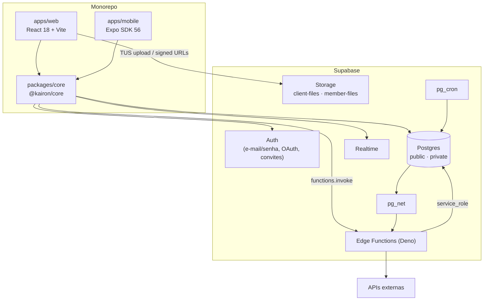

# Arquitetura

## Visão geral

O Kairon Dashboard é um **monorepo npm workspaces** com dois clientes (web e mobile) que compartilham um pacote de domínio (`@kairon/core`) e falam diretamente com um projeto **Supabase**. Não existe API própria: o "backend" é Postgres (RLS, RPCs, triggers, cron) somado a Edge Functions para o que exige segredo ou chamada externa.



## Camadas

| Camada | Local | Responsabilidade |
|---|---|---|
| **Apresentação web** | `apps/web/src/features/*/pages`, `components` | Telas, formulários, Kanbans, gráficos |
| **Apresentação mobile** | `apps/mobile/src/app`, `components` | Telas nativas (expo-router) |
| **Estado de servidor** | TanStack Query (`makeQueryClient` no core) | Cache, refetch e invalidação por `queryKeys` |
| **Estado de app** | `AuthContext`, `NotificationsContext` (web), `LeadBadgeContext` (mobile) | Sessão, perfil e notificações |
| **Acesso a dados** | `packages/core/src/api/*.api.js` | Chamadas `supabase.from/rpc/functions.invoke` |
| **Regras de cálculo** | `packages/core/src/finance/finance.calc.js` | Funções puras (MRR, receita, DRE, CAC, NRR...) |
| **Autorização** | Policies RLS e helpers `private.*` | Quem lê e escreve cada linha |
| **Regras transacionais** | RPCs `public.*` (`criar_contrato`, `convert_lead_to_cliente`...) | Operações atômicas e validadas no banco |
| **Automação** | Triggers, `pg_cron`, `pg_net` | Notificações, onboarding, expiração de contratos, push |
| **Integrações e segredos** | `supabase/functions/*` | OAuth, APIs de terceiros, IA, administração de usuários |

## `@kairon/core`

Pacote interno sem build (o código-fonte é consumido direto, como ESM), com `exports` por subpath:

| Subpath | Conteúdo |
|---|---|
| `@kairon/core/supabase/client` | `initSupabase`, `getSupabase`, `supabase` (Proxy lazy) |
| `@kairon/core/api/<modulo>.api` | `clientesApi`, `contratosApi`, `leadsApi`, `tarefasApi`, `metasApi`, `financeiroApi`, `custosApi`, `parcelasApi`, `pagamentosApi`, `invitesApi`, `usersApi`, `squadsApi`, `squadMembrosApi`, `projetosApi`, `calendarioApi`, `campanhasApi` |
| `@kairon/core/finance/finance.calc` | Todo o cálculo financeiro |
| `@kairon/core/auth/session` | `fetchProfile`, `mapProfileToUser` |
| `@kairon/core/entities/query-keys` | Chaves do TanStack Query |
| `@kairon/core/lib/query-client` | `makeQueryClient` (defaults: `retry: 1`, sem refetch on focus) |

**Inicialização do cliente:** cada app chama `initSupabase()` no boot (`apps/web/src/main.jsx`, `apps/mobile/src/app/_layout.tsx`) com as próprias variáveis de ambiente. O export `supabase` é um **Proxy** que resolve o cliente real só na hora do acesso, de modo que a ordem dos imports não importa. O core **não lê `import.meta.env`**, com uma exceção: `invites.api.js` lê `VITE_SITE_URL` com optional chaining.

**Shims:** `apps/web/src/features/*/api/*.api.js`, `src/infrastructure/supabase/client.js` e `src/shared/lib/query-client.js` só reexportam o core. Eles existem para manter os imports antigos funcionando depois da extração do monorepo (branch `chore/monorepo-extraction`).

**Módulos que ainda vivem só no web** (não migrados para o core): `notifications.api.js`, `relatorios.api.js`, `arquivos.api.js` (TUS + Storage), `memberDocs.api.js`, `googleCalendar.api.js` e `lib/ads*.js`.

## Fluxo de dados típico

```
Componente ──useQuery(queryKeys.x, xApi.list)──► @kairon/core/api ──► supabase-js ──► PostgREST
                                                                                       │ RLS
Componente ◄──────────────── cache TanStack Query ◄──────────────── linhas permitidas ─┘

Mutação ──► xApi.update ──► PostgREST / RPC ──► invalidateQueries(queryKeys.x)
Realtime (leads, notifications, metas, financeiro) ──► invalidateQueries / atualização local
```

## Autorização em duas camadas

1. **UI (experiência de uso):** `App.jsx` monta um conjunto de rotas diferente para `tv` e `Filmmaker`. `DashboardLayout` calcula flags (`podeUsarCrm`, `podeVerTarefas`...) para o menu. Os wrappers de página (`ClientesPageWrapper`, `SquadsPageWrapper`...) exibem `RestrictedAccessCard`.
2. **Banco (segurança):** policies RLS e RPCs. Veja [auth.md](auth.md) e [security.md](security.md).

## Decisões relevantes

Resumidas em [decisions.md](decisions.md): Supabase sem backend próprio, monorepo com core sem build, cálculo financeiro centralizado, segredos apenas em Edge Functions, migrations idempotentes aplicadas manualmente.
