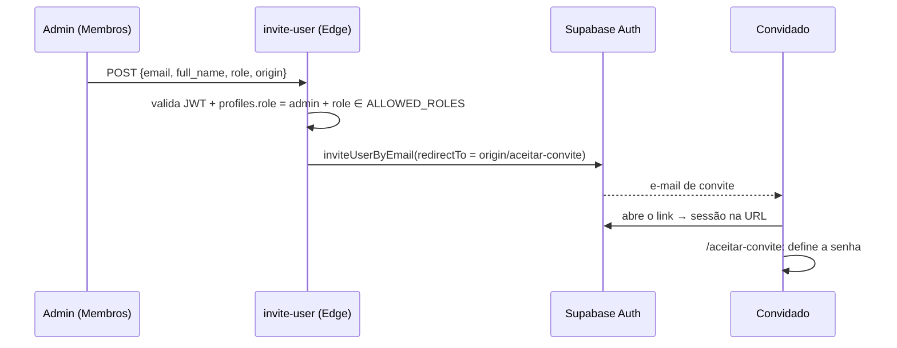

# Autenticação e autorização

## Autenticação

| Item | Implementação |
|---|---|
| Provedor | Supabase Auth |
| Métodos (web) | E-mail e senha (`signInWithPassword`), **Google** e **Apple** OAuth (`signInWithOAuth`), recuperação de senha (`resetPasswordForEmail`) |
| Métodos (mobile) | E-mail e senha |
| Sessão (web) | `persistSession` + `autoRefreshToken` em localStorage. `detectSessionInUrl: true` processa tokens de convite, recovery e OAuth |
| Sessão (mobile) | AsyncStorage (`authStorage`) e `detectSessionInUrl: false` |
| Entrada de usuários | Por **convite** do admin (Edge Function `invite-user`). Não há tela de cadastro |

> Contas criadas **sem convite** (signup ou login social de quem não é da equipe) nascem com o papel `pendente`, que não acessa dados. Elas ficam na tela "Aguardando aprovação" até um admin definir o papel em Membros (migration `20261005000100`).
>
> ⚠️ **Precisa de validação manual:** o fato de não existir tela de cadastro **não impede** o signup. Confira em Authentication → Providers se o signup público está desligado e quais providers OAuth estão ativos. Veja [security.md](security.md#2-cadastro-aberto-e-papel-padrão-sdr).

### Ciclo de vida da sessão (web)

`apps/web/src/features/auth/context/AuthContext.jsx`:

1. `getSession()` no mount e assinatura de `onAuthStateChange`.
2. `hydrateUser(session)` chama `fetchProfile()` do core, que lê `profiles (id, email, full_name, role, archived_at)`.
3. `mapProfileToUser()`: se `archived_at` estiver preenchido, faz `signOut()` e redireciona para `/login?reason=archived`.
4. **Se a leitura do perfil falhar**, o usuário segue autenticado com `role: 'sdr'` como fallback. Isso afeta só a UI; o RLS continua valendo.
5. `ProtectedRoute` segura a renderização até `authChecked` e manda para `/login` quem não está autenticado.

O mobile (`apps/mobile/src/auth/AuthContext.tsx`) replica a lógica, e o redirecionamento acontece em `src/app/_layout.tsx` via `useSegments`.

### Fluxo de convite

- **Reenviar:** `{ email, resend: true }`. **Cancelar:** `cancel-invite { user_id }` apaga o usuário que ainda não logou.
- A origem do link vem de `VITE_SITE_URL` ou de `window.location.origin` (front), com fallback para o secret `SITE_URL` na função. **Cadastre cada origem em Authentication → URL Configuration → Redirect URLs.**

### Arquivamento e exclusão (`manage-user`)

| Ação | Efeito |
|---|---|
| `archive` | Bane o usuário em `auth.users` (~100 anos), preenche `profiles.archived_at` e remove o usuário de `squad_membros` |
| `unarchive` | Remove o ban e limpa `archived_at`. **Não** recoloca o usuário nos squads |
| `delete` | Apaga de `auth.users`. O `CASCADE` remove `profiles`; registros como clientes, tarefas e leads ficam com o autor/responsável `NULL` |

Proteções: o admin não pode aplicar essas ações a si mesmo, e não é possível ficar sem nenhum admin ativo (na função e no trigger `profiles_archive_guard`).

## Autorização

### Papéis

Definidos em `profiles.role` (com `CHECK`) e espelhados em `apps/web/src/features/administrativo/lib/roleConfig.js`:

`admin` · `dev` · `head` · `cs` · `social media` · `editor` · `designer` · `closer` · `sdr` · `bdr` · `Filmmaker` · `tv` · `pendente`

`pendente` é o default do banco para contas novas e não é oferecido no convite (`INVITE_ROLE_KEYS`). Ele não passa em nenhum helper de acesso nem em `private.is_member()`.

> Os valores são **case-sensitive**: `Filmmaker` tem maiúscula e `social media` tem espaço. Use sempre o valor exato.

### Matriz de acesso: UI web

✅ acesso · 👁 somente leitura · ⚠️ aparece no menu, mas a página bloqueia · — sem acesso

`pendente` não aparece na tabela porque não acessa nenhum módulo: vê só a tela "Aguardando aprovação".

| Módulo | admin | dev | head | cs | social media | editor | designer | closer | sdr | bdr | Filmmaker | tv |
|---|---|---|---|---|---|---|---|---|---|---|---|---|
| Visão Geral | ✅ | ✅ | ✅ | ✅ | ✅ | ✅ | ✅ | ✅ | ✅ | ✅ | ✅ | — |
| Calendário | ✅ | ✅ | ✅ | ✅ | ✅ | ✅ | ✅ | ✅ | ✅ | ✅ | ✅ | — |
| Metas | ✅ | ✅ | ✅ | ✅ | ✅ | ✅ | ✅ | ✅ | ✅ | ✅ | — | 👁 |
| Comercial (leads) | ✅ | ✅ | — | — | — | — | — | ✅ | ✅ | ✅ | — | — |
| Campanhas | ✅ | — | — | — | — | — | — | — | — | — | — | — |
| Tarefas | ✅ | ⚠️ | ✅ | ✅ | ✅ | ✅ | ✅ | — | — | — | ✅ | — |
| Clientes | ✅ | ✅ | ✅ | ✅ | ✅ | — | — | — | — | — | — | — |
| Squads | ✅ | ✅ | ✅ | ⚠️ | — | — | — | — | — | — | ✅ (os seus) | — |
| Membros | ✅ | — | — | — | — | — | — | — | — | — | — | — |
| Financeiro | ✅ | — | — | — | — | — | — | — | — | — | — | — |
| Relatórios | ✅ | — | — | — | — | — | — | — | — | — | — | — |

**Fontes:** `app/App.jsx` (rotas para `tv` e `Filmmaker`), `dashboard/pages/DashboardLayout.jsx` (menu), `*PageWrapper.jsx`, `MinhasTarefasPage.jsx` (`TAREFAS_ROLES`) e as páginas de Financeiro, Relatórios e Administrativo (`role === 'admin'`).

**Permissões finas dentro dos módulos** (UI):

| Ação | Papéis |
|---|---|
| Gerenciar eventos do calendário | admin, head, dev |
| Gerenciar contratos de um cliente | admin, head, cs |
| Usar onboarding em Tarefas | admin, head, cs |
| Decidir sobre um lead (detalhe) | admin, head, closer |
| Agendar reunião a partir de um lead | admin, closer |
| Remover uma venda em Metas | admin, ou o autor (se a venda não veio de contrato) |
| Conectar Google Calendar / sincronizar | admin, head (Edge Function) |

### Mobile

| Aba | Papéis |
|---|---|
| Hoje, Calendário | Todos os autenticados |
| Leads | `admin`, `closer`, `sdr`, `bdr` (`ROLES_COMERCIAL` em `apps/mobile/src/constants/leads.ts`) |

### Banco (RLS)

A autorização efetiva está nas policies e nos helpers `private.*` (lista em [database.md](database.md#rls-e-helpers-de-autorização)). Pontos principais:

- **`dev`** é tratado como admin pelos helpers genéricos (`is_admin`, `is_admin_or_head`, `is_admin_or_closer`). As exceções são **perfis** e **campanhas**, que usam `is_strict_admin`, para que `dev` não consiga se autopromover nem ver mídia.
- **`head`** tem acesso operacional e comercial equivalente ao de admin, mas não gerencia papéis.
- **`sdr`/`bdr`** leem todos os leads e atualizam os `pendente` ou os que estão sob sua responsabilidade.
- **`editor`/`social media`** (`is_own_tasks_only`) editam apenas tarefas próprias.
- **Arquivos de clientes, calendário, squads, metas, vendas e lista de perfis:** qualquer **membro** (`private.is_member()`: papel ≠ `pendente` e não arquivado).
- **Troca de `role`/`email`:** só admin ou contexto de sistema (trigger `profiles_identity_guard`).
- **Notificações e push tokens:** cada usuário acessa só os próprios.

### Divergências conhecidas

Encontradas na análise do código. Precisam de decisão de negócio:

| # | Divergência | Onde |
|---|---|---|
| 1 | `dev` vê **Tarefas** no menu, mas `TAREFAS_ROLES` não inclui `dev` | `DashboardLayout.jsx` × `MinhasTarefasPage.jsx` |
| 2 | `cs` vê **Squads** no menu, mas `SquadsPageWrapper` não inclui `cs` | `DashboardLayout.jsx` × `SquadsPageWrapper.jsx` |
| 3 | `dev` tem acesso de admin no banco (inclusive a dados financeiros), mas a UI esconde Financeiro, Relatórios e Membros | helpers `private.*` × `Sidebar.jsx` |
| 4 | `roleConfig` descreve `designer` como "edita apenas tarefas próprias", mas `is_own_tasks_only()` cobre só `editor` e `social media` | `roleConfig.js` × `schema.sql` |
| 5 | `dev` acessa Comercial no web, mas não vê a aba Leads no mobile | `DashboardLayout.jsx` × `constants/leads.ts` |
| 6 | Comentários de `meta-ads`/`google-ads` dizem "admin/head", mas o código exige `admin` | `supabase/functions/*-ads/index.ts` |
| 7 | ~~Um usuário podia alterar o próprio `role` pelo RLS~~ (corrigido pela migration `20261005000000`) | [security.md #1](security.md#1-escalada-de-privilégio-via-profilesrole) |

> **Recomendação:** centralizar a matriz de papéis em `@kairon/core` (ex.: `core/auth/permissions.js`) e consumi-la no web, no mobile e na documentação. Hoje as listas estão espalhadas em mais de 10 arquivos.

### Adicionando um papel novo

1. Migration que atualiza `profiles_role_check` (siga o padrão de `20260612000000_role_check_designer_cs.sql`).
2. Ajustar os helpers `private.*` e as policies afetadas.
3. Se o papel deve acessar dados compartilhados, garanta que ele passe em `private.is_member()` (todo papel ≠ `pendente` passa).
4. Incluir o papel em `ALLOWED_ROLES` de `supabase/functions/invite-user/index.ts` e redeployar a função.
5. Incluir o papel em `roleConfig.js` (label, ícone, descrição).
6. Revisar as listas de papéis no web (`DashboardLayout`, wrappers, `TAREFAS_ROLES`...) e no mobile (`ROLES_COMERCIAL`).
7. Atualizar a matriz deste documento.
