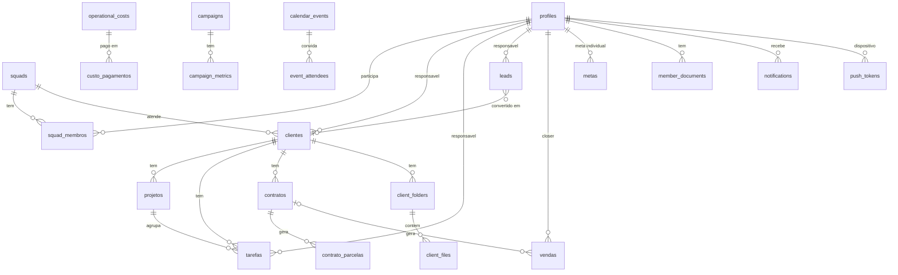

# Banco de dados (Supabase Postgres)

## Sumário

- [Organização dos arquivos SQL](#organização-dos-arquivos-sql)
- [Bootstrap de um ambiente novo](#bootstrap-de-um-ambiente-novo)
- [Modelo de dados](#modelo-de-dados)
- [Tabelas](#tabelas)
- [RLS e helpers de autorização](#rls-e-helpers-de-autorização)
- [RPCs](#rpcs)
- [Triggers](#triggers)
- [Jobs (pg_cron)](#jobs-pg_cron)
- [Storage](#storage)
- [Realtime](#realtime)
- [Como criar uma migration](#como-criar-uma-migration)

## Organização dos arquivos SQL

| Caminho | Conteúdo |
|---|---|
| `supabase/schema.sql` | Schema base: `profiles`, `squads`, `clientes`, `projetos`, `tarefas`, `leads`, `contratos`, `campaigns`, helpers `private.*`, RPCs e policies. Escrito para ser **idempotente** |
| `supabase/migrations/` | 28 migrations incrementais (maio a junho/2026), nomeadas `YYYYMMDDHHMMSS_descricao.sql` e todas idempotentes |
| `supabase/triggers/` | Triggers de criação de cliente (projetos Onboarding e Backlog) |
| `supabase/cron/` | Agendamento `pg_cron` de expiração de contratos |
| `supabase/config.toml` | Config do Supabase CLI (`project_id` e `verify_jwt` por função) |

> **Precisa de validação manual:** o histórico indica que os scripts são aplicados **pelo SQL Editor**, não por `supabase db push`. A pasta `migrations/` não contém o schema base, então um `supabase db reset` a partir só das migrations falharia. Confirme em produção qual é o estado aplicado (`supabase_migrations.schema_migrations`, se existir).

## Bootstrap de um ambiente novo

1. **Extensões:** em Database → Extensions, habilite `pg_cron` e `pg_net`.
2. **Ajustes de ambiente** (os arquivos têm valores de produção fixos):
   - `migrations/20260608000000_push_tokens.sql`: em `private.notifications_push_fanout()`, troque `v_url` e `v_anon` pela URL e anon key do novo projeto.
   - `triggers/onboarding_on_cliente.sql`: troque o e-mail usado para achar o responsável pelas tarefas de onboarding.
3. **Execute no SQL Editor, nesta ordem:**
   1. `schema.sql`
   2. `migrations/*.sql` em ordem alfabética (ex.: `ls supabase/migrations | sort`)
   3. `triggers/onboarding_on_cliente.sql` e depois `triggers/backlog_on_cliente.sql`
   4. `cron/expirar_contratos.sql`
4. **Auth:** configure Site URL e Redirect URLs (incluindo `<origem>/aceitar-convite`) e revise o signup público (veja [security.md](security.md#2-cadastro-aberto-e-papel-padrão-sdr)).
5. **Primeiro admin:** `UPDATE public.profiles SET role = 'admin' WHERE email = '<email>';`

> `migrations/20260619000200_contrato_parcelas_backfill.sql` é um passo de **dados** (gera parcelas para contratos já existentes). Em um banco vazio ele não faz nada, mas leia o arquivo antes de reaplicá-lo em produção.

## Modelo de dados

## Tabelas

Todas as 24 tabelas de `public` têm **RLS habilitado**.

| Tabela | Domínio | Colunas principais | Observações |
|---|---|---|---|
| `profiles` | Usuários | `id` (= `auth.users.id`), `email`, `full_name`, `role`, `archived_at` | Criada pelo trigger `on_auth_user_created`. `role` tem `CHECK` com os 12 papéis |
| `squads` / `squad_membros` | Times | `nome`, `descricao` / (`squad_id`, `profile_id`) | |
| `clientes` | Carteira | `nome`, `empresa`, `status` (`ativo`/`churn`), `origem` (`manual`/`lead`), `squad_id`, `responsavel_id`, `churned_at` | Churn bloqueado se houver contrato ativo |
| `projetos` | Entrega | `nome`, `status` (`ativo`/`pausado`/`concluido`), `cliente_id`, `prazo` | |
| `tarefas` | Entrega | `titulo`, `status` (`pendente`/`em_andamento`/`revisao`/`concluida`), `prioridade`, `prazo`, `responsavel_id`, `cliente_id`, `projeto_id`, `created_by` | `created_by` travado por trigger |
| `leads` | Comercial | `nome`, `email`, `telefone`, `faturamento_mensal`, `status`, `origem`, `responsavel_id`, `cliente_id`, `atendimento_iniciado_em` | Status: `pendente`, `em_atendimento`, `follow_up`, `reuniao_marcada`, `perdido` |
| `contratos` | Financeiro | `cliente_id`, `tipo` (`MRR`/`TCV`), `valor`, `duracao_meses`, `data_inicio`, `data_fim`, `status`, `renovacao_de`, `total_recebido` | `cliente_id ON DELETE RESTRICT`. Criação e cancelamento só via RPC |
| `contrato_parcelas` | Financeiro | `contrato_id`, `competencia`, `valor`, `vencimento`, `pago_em`, `status`, `metodo_pagamento`, `gateway_id` | Cronograma de recebíveis. Os campos `gateway_*` estão preparados para integração futura |
| `vendas` | Metas | `closer_id`, `valor`, `tipo`, `cliente_nome`, `data_venda`, `contrato_id` | Vendas avulsas, ou geradas por `criar_contrato` |
| `metas` | Metas | `competencia`, `usuario_id` (NULL = meta global), `valor_meta` | |
| `operational_costs` | Financeiro | `description`, `category`, `amount`, `competencia`, `recurring` | Admin only |
| `custo_pagamentos` | Financeiro | `custo_id`, `competencia`, `valor`, `pago_em` | Controle de "Contas a Pagar" dos custos recorrentes |
| `finance_config` | Financeiro | `id = 1`, `saldo_inicial`, `saldo_inicial_data` | Linha única |
| `campaigns` / `campaign_metrics` | Mídia | `platform`, `objective`, `status` (`active`/`paused`/`ended`), `budget`, `external_id` / `date`, `spend`, `clicks`, `conversions`, `roas` | Admin only (`is_strict_admin`) |
| `calendar_events` / `event_attendees` | Calendário | `type` (`meeting`/`activity`/`delivery`), `start_at`, `end_at`, `audience_type` (`all`/`squad`/`user`/`clevel`), `google_event_id`, `notified_24h_at`, `notified_20m_at` | |
| `google_calendar_credentials` | Integração | `id = true` (linha única), `refresh_token`, `access_token`, `oauth_state` | `REVOKE ALL` para `anon` e `authenticated`. Só `service_role` acessa |
| `client_folders` / `client_files` | Arquivos | `client_id`, `parent_id` (pastas aninhadas) / `storage_path`, `mime_type`, `size_bytes` | Acesso aberto a qualquer autenticado (veja security.md) |
| `member_documents` | RH | `profile_id`, `storage_path`, `doc_type` | Admin only |
| `notifications` | Notificações | `user_id`, `type`, `title`, `body`, `link`, `metadata`, `read_at` | Cada usuário vê só as próprias |
| `push_tokens` | Mobile | `user_id`, `token`, `platform` | Upsert por token |

**View:** `user_invites_view` (`security_invoker = true`) junta `profiles` e `auth.users` para distinguir convites pendentes (`last_sign_in_at IS NULL`).

## RLS e helpers de autorização

Os helpers ficam no schema `private` (fora da Data API), são `SECURITY DEFINER` e consultam `profiles.role` de `auth.uid()`:

| Helper | Papéis (estado após as migrations) |
|---|---|
| `private.is_admin()` | `admin`, `dev` |
| `private.is_strict_admin()` | `admin` (usado em perfis e campanhas) |
| `private.is_admin_or_head()` | `admin`, `head`, `dev` |
| `private.is_admin_or_closer()` | `admin`, `closer`, `head`, `dev` |
| `private.is_sdr_or_bdr()` | `sdr`, `bdr` |
| `private.is_crm_only()` | `sdr`, `bdr`, `closer` |
| `private.is_own_tasks_only()` | `editor`, `social media` |
| `private.get_user_squad_ids()`, `can_access_cliente()`, `user_has_tarefa_for_*()` | Escopo por squad e por tarefa |
| `private.count_active_admins()` | Proteção contra ficar sem admin |

> A lista acima reflete a **última definição** encontrada nos arquivos versionados. Para o estado real, rode `SELECT prosrc FROM pg_proc WHERE proname = '<helper>';` em produção.

Há 111 `CREATE POLICY` nos arquivos. Para a matriz por papel, veja [auth.md](auth.md).

## RPCs

Funções `public.*` chamadas pelo front via `supabase.rpc()`:

| RPC | Quem pode | O que faz |
|---|---|---|
| `create_lead_from_webhook(p_nome, p_empresa, p_email, p_telefone, p_momento_empresa, p_objetivo_principal, p_origem, p_faturamento_mensal)` | `anon`, `authenticated` | Cria lead `pendente`. Usada pela landing page e pelo "Novo lead" manual |
| `convert_lead_to_cliente` | admin, head, closer | Cria o cliente (`origem = 'lead'`) e vincula `leads.cliente_id` de forma atômica |
| `criar_contrato` | admin, head (validação interna; `EXECUTE` liberado para `authenticated`) | Cria o contrato, calcula `data_fim`, gera a venda do closer e as parcelas |
| `cancelar_contrato` | admin, head | Cancela o contrato, calcula ou aceita `total_recebido` e ajusta parcelas futuras |
| `expire_due_contracts()` | `authenticated` e cron | Marca como `expirado` contratos ativos com `data_fim` vencida |
| `gerar_parcelas_contrato` | interno | Gera o cronograma de `contrato_parcelas` |
| `apagar_cliente_completo` | admin, head, dev (`is_admin_or_head`) | Apaga o cliente e **todos** os contratos, projetos, tarefas e leads vinculados, em uma transação |
| `mrr_base_ativo()` / `tcv_mes_ativo()` | autenticados | Agregados para a tela de Metas, sem expor contratos a closers e TV |
| `google_calendar_status()` | admin, head | Status da conexão Google, sem expor tokens |
| `notify_upcoming_events()` | cron | Gera lembretes de 24h e 20min |

## Triggers

| Trigger | Tabela | Efeito |
|---|---|---|
| `on_auth_user_created` | `auth.users` | Cria `profiles` com `role = 'sdr'` |
| `profiles_archive_guard` | `profiles` | Impede autoarquivamento e mudança de papel de usuário arquivado, e garante ≥ 1 admin ativo |
| `on_cliente_created_01_onboarding` | `clientes` | Cria o projeto "Onboarding" com tarefas iniciais |
| `on_cliente_created_02_backlog` | `clientes` | Cria o projeto "Backlog" (o prefixo numérico garante a ordem) |
| `clientes_block_churn_if_active_contract` / `clientes_stamp_churned_at` | `clientes` | Integridade do churn |
| `leads_atendimento_guard` | `leads` | Valida o responsável, promove o status e registra `atendimento_iniciado_em` |
| `leads_notify_new` | `leads` | Notifica o time comercial sobre um novo lead |
| `vendas_notify_meta` | `vendas` | Notifica quando a meta é atingida (`private.notify_meta_atingida`) |
| `contratos_lock_created_by` / `tarefas_lock_created_by` | — | Impede alterar o autor |
| `notifications_push_fanout` | `notifications` | `pg_net` → Edge Function `push-fanout` |
| `*_touch_updated_at` | várias | Mantém `updated_at` |

## Jobs (pg_cron)

| Job | Agenda | Definido em | Ação |
|---|---|---|---|
| `expirar-contratos` | `0 3 * * *` (03:00 UTC = 00:00 BRT) | `cron/expirar_contratos.sql` | `SELECT public.expire_due_contracts();` |
| `notify-upcoming-events` | `*/5 * * * *` | `migrations/20260604000000_calendar_20min_reminder.sql` | `SELECT public.notify_upcoming_events();` |

Para conferir: `SELECT jobname, schedule, active FROM cron.job;`

## Storage

| Bucket | Público | Limite por arquivo | Path | Uso |
|---|---|---|---|---|
| `client-files` | Não | 5 GB | `<client_id>/<uuid>` | Arquivos de clientes. Upload resumível via TUS (`/storage/v1/upload/resumable`) |
| `member-files` | Não | 200 MB | `<profile_id>/<uuid>` | Documentos de colaboradores (admin only) |

O download é feito com **URLs assinadas** (`createSignedUrl(s)`). A metadata fica em `client_files` e em `member_documents`.

## Realtime

Tabelas na publicação `supabase_realtime`: `leads`, `clientes`, `contratos`, `campaign_metrics`, `notifications`, `metas`, `vendas`, `contrato_parcelas`, `custo_pagamentos`, `finance_config` e `operational_costs`. O Realtime **respeita RLS**: cada usuário recebe apenas os eventos das linhas que pode ler.

| Canal (web) | Onde |
|---|---|
| `leads-realtime` | `comercial/components/LeadsKanban.jsx` |
| `financeiro-realtime` | `financeiro/pages/FinanceiroPage.jsx` |
| `metas-realtime` | `metas/pages/MetasPage.jsx` |
| `notifications:<user_id>` | `notifications/NotificationsContext.jsx` |

## Como criar uma migration

1. Crie o arquivo `supabase/migrations/YYYYMMDDHHMMSS_descricao.sql`.
2. Comece com um cabeçalho explicando **o porquê**, no padrão dos arquivos existentes.
3. Escreva de forma idempotente: `CREATE TABLE IF NOT EXISTS`, `ADD COLUMN IF NOT EXISTS`, `DROP POLICY IF EXISTS` antes de `CREATE POLICY` e `CREATE OR REPLACE FUNCTION`.
4. Toda tabela nova precisa de `ENABLE ROW LEVEL SECURITY` e policies explícitas.
5. Funções `SECURITY DEFINER` precisam de `SET search_path` e de checagem de papel.
6. Aplique primeiro em dev, depois em produção, e atualize este documento.
