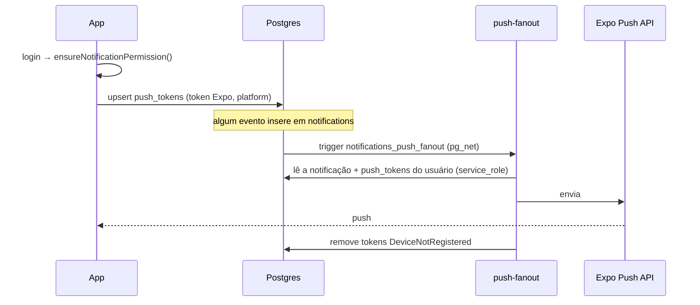

# App mobile (`apps/mobile`)

App Expo (SDK 56, React Native 0.85, React 19) com **Expo Router** (rotas por arquivo em `src/app`), React Compiler e typed routes habilitados. Ele consome o mesmo `@kairon/core` do web.

> As APIs do Expo mudaram no SDK 56. Antes de alterar código nativo ou de configuração, consulte a documentação versionada em https://docs.expo.dev/versions/v56.0.0/ (veja também `apps/mobile/AGENTS.md`).

## Telas

| Arquivo | Tela | Conteúdo |
|---|---|---|
| `src/app/login.tsx` | Login | E-mail e senha |
| `src/app/(tabs)/index.tsx` | **Hoje** | Saudação, tarefas e eventos do dia, perfil (`PerfilSheet`) e, para admin, `FinanceiroSheet` (MRR por cliente) |
| `src/app/(tabs)/agenda.tsx` | **Calendário** | `MonthCalendar` com tarefas e eventos. Criação via `NovoItemModal` |
| `src/app/(tabs)/comercial/index.tsx` | **Leads** | Pipeline de leads. Criação via `NovoLeadModal` |
| `src/app/(tabs)/comercial/[id].tsx` | Detalhe do lead | Edição, troca de status, perda e exclusão. Contato por telefone/WhatsApp (`lib/contact.ts`) |

A tab bar é **nativa** (`expo-router/unstable-native-tabs`). No iOS 26 ela usa o Liquid Glass. A aba Leads aparece só para `ROLES_COMERCIAL` (`admin`, `closer`, `sdr`, `bdr`) e mostra um badge de não lidos (`LeadBadgeContext`).

## Arquitetura

```
src/app/_layout.tsx
  ├─ initSupabase({ url, anonKey, authStorage: AsyncStorage })
  ├─ QueryClientProvider (makeQueryClient do core)
  ├─ AuthProvider          (src/auth/AuthContext.tsx — porta do web)
  ├─ LeadBadgeProvider     (src/notifications/LeadBadgeContext.tsx)
  └─ RootNavigator         redireciona login ⇄ (tabs) e registra push
```

- **Dados:** TanStack Query com `queryKeys` e APIs do core (`tarefasApi`, `calendarioApi`, `leadsApi`, `usersApi`, `clientesApi`).
- **Tipos:** o core é JS. `src/types/kairon-core.d.ts` declara os módulos consumidos e `src/types/models.ts` traz os modelos.
- **Metro em monorepo** (`metro.config.js`): observa a raiz, resolve `node_modules` do app e da raiz, e habilita `unstable_enablePackageExports` para os subpaths `@kairon/core/api/*`.
- **Tema:** `src/constants/kairon.ts` e `theme.ts`. Modo escuro fixo (`userInterfaceStyle: dark`).

## Push notifications



- O código fica em `src/notifications/push.ts` e `usePushNotifications.ts`.
- Push exige **dispositivo físico** e o `extra.eas.projectId` de `app.json`.
- Com o app em foreground, o banner também é exibido.
- Tocar na notificação navega conforme o `link` da notificação.

## Rodando

```bash
cp apps/mobile/.env.example apps/mobile/.env   # EXPO_PUBLIC_SUPABASE_URL / _ANON_KEY
npm run mobile            # expo start (na raiz)
npm run mobile:ios        # expo run:ios (exige Xcode)
npm run mobile:android    # expo run:android
```

- O projeto usa **`expo-dev-client`**, então rode em um development build, não no Expo Go.
- O **`postinstall`** executa `scripts/patch-expo-modules-jsi.js`, um patch idempotente para o `expo-modules-jsi` compilar com o Xcode 26 / Swift 6. Remova quando o Expo publicar a correção.

## Build e distribuição (EAS)

`eas.json` define três perfis:

| Perfil | Uso | Distribuição |
|---|---|---|
| `development` | Dev client | interna |
| `preview` | Testes internos | interna |
| `production` | Loja | `autoIncrement` do build number (`appVersionSource: remote`) |

```bash
npx eas build --profile production --platform ios
npx eas submit --platform ios
```

- **Bundle ID:** `com.kaironcompany.mobile`.
- **Distribuição iOS:** Unlisted App Distribution. O link de download no web (`apps/web/src/shared/config/app.js`) ainda é um **placeholder** (TODO no código).
- **Variáveis:** os perfis do `eas.json` contêm `EXPO_PUBLIC_SUPABASE_URL` e `EXPO_PUBLIC_SUPABASE_ANON_KEY` em texto. São valores públicos por design, mas recomenda-se migrar para **EAS Environment Variables** (`eas env:create`) para não acoplar o repositório a um ambiente específico.
- **Android:** ícones adaptativos e splash estão configurados, mas não há indício de publicação na Play Store (**precisa de validação manual**).
